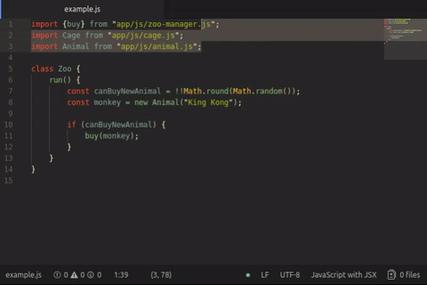

# require-js-sort package for Atom editor

Simple Atom tool for sorting your "require" and "import x from" by file path.

[](https://www.npmjs.com/package/require-js-sort)

## Example
This ...
```javascript
import {buy} from "app/js/zoo-manager.js";
import Cage from "app/js/cage.js";
import Animal from "app/js/animal.js";
```

... will be converted to ...
```javascript
import Animal from "app/js/animal.js";
import Cage from "app/js/cage.js";
import {buy} from "app/js/zoo-manager.js";
```


